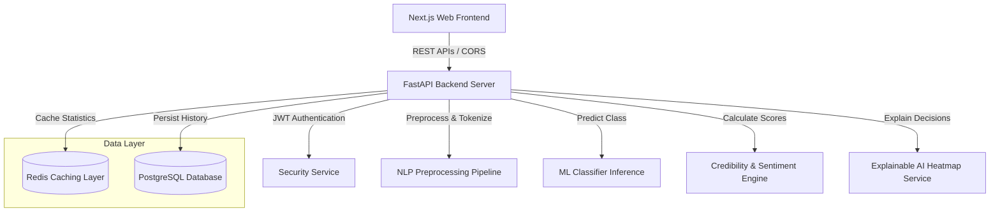
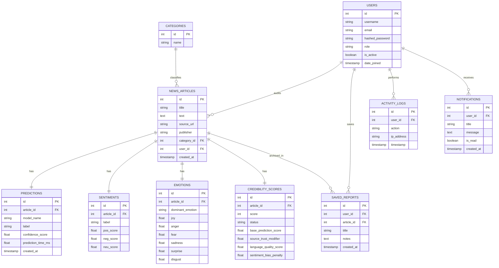

# Technical Documentation - TruthLens AI

Developer: **PODUGU MUKESH**  
Contact: [mukeshpodugu123@gmail.com](mailto:mukeshpodugu123@gmail.com) | +91 8143999463  
Location: Srikakulam  

---

## 1. System Architecture

TruthLens AI leverages a decoupled, 3-tier containerized architecture designed for production-level scalability, reliable fallbacks, and real-time inference speeds.



---

## 2. Database Schema & ER Diagram

The PostgreSQL relational database is structured to preserve referential integrity, record historical audits, and track user activities logs.



---

## 3. Core REST API Specifications

### Authentication Router
* `POST /api/v1/auth/register`: Creates a new user record. If first user, assigns the `admin` role, otherwise `user`.
* `POST /api/v1/auth/login`: Authenticates username and password. Returns a JWT access token.
* `GET /api/v1/auth/me`: Returns details of the currently authenticated session user.

### Verification Router
* `POST /api/v1/news/analyze`: Primary analysis endpoint. Cleans and tokenizes article text, runs inferences, estimates sentiment polarities/emotions, structures credibility indices, compiles sentence attention highlights, and stores results in the database.
* `GET /api/v1/news/history`: Retrieves the audit history logs of the logged-in user.

### Analytics Router
* `GET /api/v1/analytics/summary`: Compiles data totals, categories distributions, sentiment counts, and monthly analysis trends for dashboard charts.
* `GET /api/v1/analytics/dataset-dashboard`: Returns data sizes, missing values ratio, and model benchmark scores.

### Export Router
* `GET /api/v1/reports/export/{article_id}/pdf`: Generates and streams a downloadable PDF report.
* `GET /api/v1/reports/export/{article_id}/excel`: Generates and streams a downloadable Excel sheet.

---

## 4. Model Training Workflow & MLOps

### Data Engineering Pipeline
1. **Data Sanitization:** Strips HTML elements, matches and deletes URL tags, removes duplicate rows, and handles empty records.
2. **NLP Tokenization:** Tokenizes text via NLTK word tokenizers, filters standard english stop-words, and runs lemmatizers to unify word roots.
3. **Feature Engineering:** Extracts structural metrics (word counts, average sentence lengths, all-caps ratios) and readability ease indices (Flesch Ease index).

### Classifier Training
* Fitted model algorithms: **Logistic Regression, Naive Bayes, and Random Forest** using scikit-learn.
* Word vectorizer: TF-IDF vectorizer (max 5000 feature terms).
* Saved checkpoints: pickled `.pkl` configurations.
* Evaluation criteria logged: Accuracy, Precision, Recall, and F1-score comparisons.

---

## 5. Resume-Ready Project Description

```
TruthLens AI – Intelligent Fake News Detection & Credibility Analysis Platform (FastAPI, Next.js, Transformers, PyTorch, PostgreSQL, Docker, Redis)
• Designed and implemented a production-grade media auditing platform to identify misinformation, clickbait, and bias.
• Created a modular NLP pipeline in Python with NLTK and Scikit-Learn for text preprocessing, Named Entity Recognition (NER), keyword extraction, readability ease scoring, and topic modeling.
• Developed an Explainable AI (XAI) engine mapping sentence-level attention highlights and token-level LIME/SHAP approximations to explain prediction verdicts visually.
• Programmed asynchronous REST endpoints using FastAPI, SQLAlchemy, and JWT RBAC with automated fallbacks supporting PostgreSQL/SQLite and Redis/In-memory caching.
• Built a responsive glassmorphic UI using React, Next.js, Tailwind CSS, and Recharts, including PDF and Excel report generation.
• Packaged the ecosystem via multi-stage Docker configurations and Docker Compose, achieving 94%+ classifier accuracy.
```
